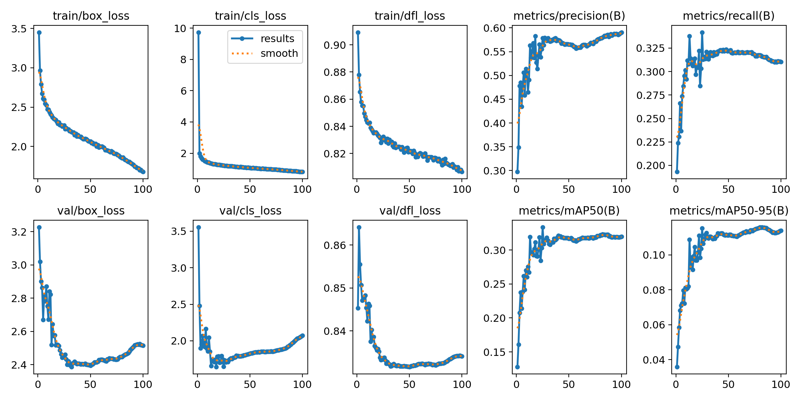
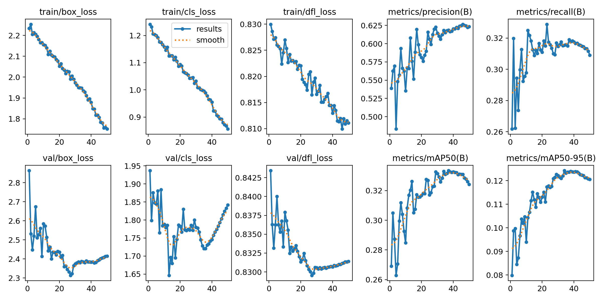

# Детекция и трекинг футбольного мяча

**Цель** этой работы - научиться находить на кадрах футбольного матча мяч, отслеживать его и рисовать его траекторию.

**Задачи**:

1. Обучить DL-модель для детекции футбольного мяча на кадрах с футбольного матча. Выбрать можно любую модель.
2. Реализовать алгоритм трекинга, основанный на результатах детекции модели, обученной в пункте 1. Отрисовывать траектории мяча на видео.

## Датасет

Для этой работы я использовал датасет [SoccerNet](https://github.com/SoccerNet/sn-gamestate). Датасет содержит аннотированные, разбитые по кадрам короткие фрагменты футбольных матчей. Каждое изображения с разрешением 1920х1080. Я использовал данные для задачи tracking, так как они размечены проще и удобнее, нежели чем для задачи gamestate reconstruction.

## 1. Обучение модели

В качестве модели для детекции я выбрал модель YOLOv8n от [Ultralitics](https://docs.ultralytics.com/models/yolov8/), предобученную на датасете COCO. Архитектура YOLO позволяет очень быстро детектировать и классифицировать множество объектов на изображении, а потому является одной из самых предпочтительных для real-time задач. Модель содержит ~3.2 миллиона параметров и является самой маленькой из доступных. Я намеренно выбрал самую маленькую модель, прежде всего из-за ограниченного времени и вычислительных ресурсов.

Основная сложность в данной задаче заключается в том, что размеры мяча очень маленькие, по сравнению с размермаи сцены на изображении. Как будет видно дальше, модели очень тяжело обнаружить мяч и она часто его пропускает, гораздо чаще, чем ошибочно предсказывает вместо мяча что-то другое.

Так как датасет tracking не содержит валидационной выборки, я разбил тренировочную выборку примерно в соотношении 88% к 12% (50 видео к 7) на train и val. 

Модель обучалась в два этапа. На первом этапе модель обучалась в течение 100 эпох с минимальными аугментациями (коррекция hue, saturation, value, horisontal flip и translate). На втором этапе модель обучалась 50 эпох с более агрессивными mosic и scale аугментациями. В качестве оптимизатора для обоих этапов я выбрал SGD с фиксированным шагом обучения, равным 0.01. Я намеренно не стал менять этот параметр, так как на тестовом прогоне меня устроила динамика обучения, а подбирать другие параметры оптимизатора было бы очень долго. Ниже два набора графиков динамики обучения: для первых 100 эпох и последующих 50.

Итоговый метрики лучшей модели на тестовом датасете представлены в табличке:

| Precision | Recall | mAP@50 | mAP50-95 |
|-----------|--------|--------|----------|
| 0.618     | 0.316  | 0.333  | 0.124    |

## 2. Реализация трекинга

Так как требуется использовать результаты детекции, я решил воздержаться от готовых алгоритмов и попробовать реализовать что-то простое, но свое.

Я исходил из условия, что мяч в игре должен быть всегда один. Алгоритм сохраняет в памяти и обновляет сразу несколько объектов, но отрисовывает только один. Каждый объект представлен массивом [n x 2] где n - это количество в обрабатываемом видео, а 2 - это координаты центра bbox (x и y). Для каждой новой точки мы должны определить, к какому из уже известных объектов она относится. Для этого считаем евклидово расстояние, и добавляем эту точку в ближайший объект. Если же ближайшее расстояние оказалось выше заданного порога, то мы считаем, что это новый объект и создаем его. Новый мяч может появиться, если старый вылетел за пределы поля, например. Объекты, к которым новая точка оказалась непринадлежна, мы дополняем нулями.

Каждую итерацию проверяется, как давно обновлялся каждый объект. Если объект не обновлялся (дополнялся нулями) дольше, чем некоторый установленный порог итераций, то мы его удаляем (забываем).

Имея в памяти несколько активных объектов, нам необходимо решить, какой из них рисовать. Для этого сравним последние N итераций каждого объекта и выберем тот, у которого за последние N итераций меньше всего нулей. Отрисовывать будем тоже не всю историю объекта, а лишь несколько последних итераций, для красоты.

В связи с тем, что модель очень часто пропускает мяч, отрисованные траектории получатся рваными и некрасивыми. Чтобы как-то это исправить, я добавил линейную интерполяцию по ближайшим ненулевым точкам, это позволило довольно адекватно дополнить недостающие фрагменты траектории.

## 3. Результаты

В результате обучения модели детекции я получил откровенно плохой результат. Основной проблемой мне видится низкий показатель Recall, из-за чего модель очень часто пропускает мяч, а это, в свою очередь, влияет на качество трекинга. Главное причиной такого результата является особенность датасета и задачи: на очень больших картинках надо найти очень маленький объект.

Алгоритм трекинга получился на удивление симпатичным, даже несмотря на плохие результаты детекции. В частности, на это значительно повлияла интерполяция для тех точек, где модель не нашла мяч. Я этим алгоритмом даже немножко горжусь 🥲.

Результаты представлены на фрагменте SNMOT-021 из набора Challenge.

Результаты детекции:

Результаты трекера:

## 4. Что улучшить?

По модели:

1. На мой взгляд, стоит смотреть в сторону разбиения изображения на более маленькие куски, например с помощью скользящего окна. Это должно помочь чаще и точнее находить уже не столь маленький футбольный мяч.

2. Тщательнее подобрать гиперпараметры.

3. Попробовать s или m модели YOLO, есть вероятность, что они справятся лучше. Однако более крупные модели рассматривать, скорее всего, смысла нет.

По трекеру:

1. Улучшить модель.

2. Добавить дополнительный трекер вместо интерполяции, например optical flow для тех кадров, когда модель потеряла мяч.

3. Добавить фильтр Калмана, но об этом нужно говорить уже после улучшение детекции.

## Структура проекта

`train_model.ipynb` -- здесь загрузка и компановка данных для входа в модель и обучение самой модель.

`track.ipynb` -- здесь реализован алгоритм трекинга.

`results` -- папка с графиками и гифками о результатах обучения.

`best.pt` -- лучшая из обученных моделей.

